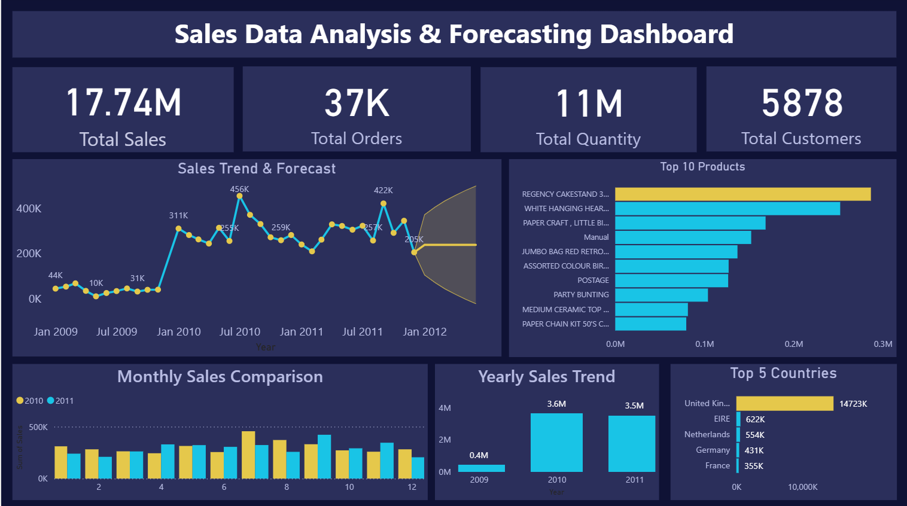

# 📊 Sales Data Analysis & Forecasting Dashboard

## 🚀 Project Overview

This project focuses on analyzing historical retail sales data and forecasting future sales trends using Power BI. The dashboard provides meaningful insights into sales performance, customer behavior, and product demand.

---

## 🎯 Objectives

* Analyze past sales data to identify trends and patterns
* Understand top-performing products and regions
* Build an interactive dashboard for business insights
* Predict future sales using forecasting techniques

---

## 🛠️ Tools & Technologies

* Power BI
* CSV Dataset
* Data Cleaning & Transformation
* Data Visualization

---

## 📂 Dataset

Due to GitHub file size limitations, a **sample dataset** is included in this repository.

👉 Full dataset available here:
https://adityagroup-my.sharepoint.com/:x:/g/personal/23p31a4221_acet_ac_in/IQB4oSzjSfq9Q6DDaGzgQsFDASZlMpmUSLi94Pt-b0kTVM8?rtime=KshnNAqF3kg
---

## 📊 Dashboard Features

### 🔹 KPI Metrics

* Total Sales
* Total Orders
* Total Customers
* Total Quantity Sold

### 🔹 Visualizations

* Sales Trend Analysis (Line Chart)
* Sales Forecasting (Time Series)
* Sales by Country
* Top 10 Products
* Monthly Sales Comparison

---

## 📈 Key Insights

* Sales show an overall increasing trend over time
* United Kingdom is the top revenue-generating country
* A small number of products contribute to the majority of sales
* Seasonal variations are observed in monthly sales
* Forecast indicates stable future growth

---

## 🔮 Forecasting

Time series forecasting is applied to predict future sales trends based on historical data. This helps in better decision-making for inventory and business planning.

---

## 🖼️ Dashboard Preview

---

## 📌 Conclusion

This project demonstrates how data analysis and visualization can help businesses make data-driven decisions. The forecasting model adds value by predicting future sales trends.

---

## 📎 Repository Contents

* Power BI Dashboard (.pbix)
* Sample Dataset (.csv)
* Dashboard Screenshot

---

## 🙌 Acknowledgment

Dataset sourced from publicly available retail datasets.

---

## 🔗 Connect with Me

(Add your LinkedIn profile link here)

